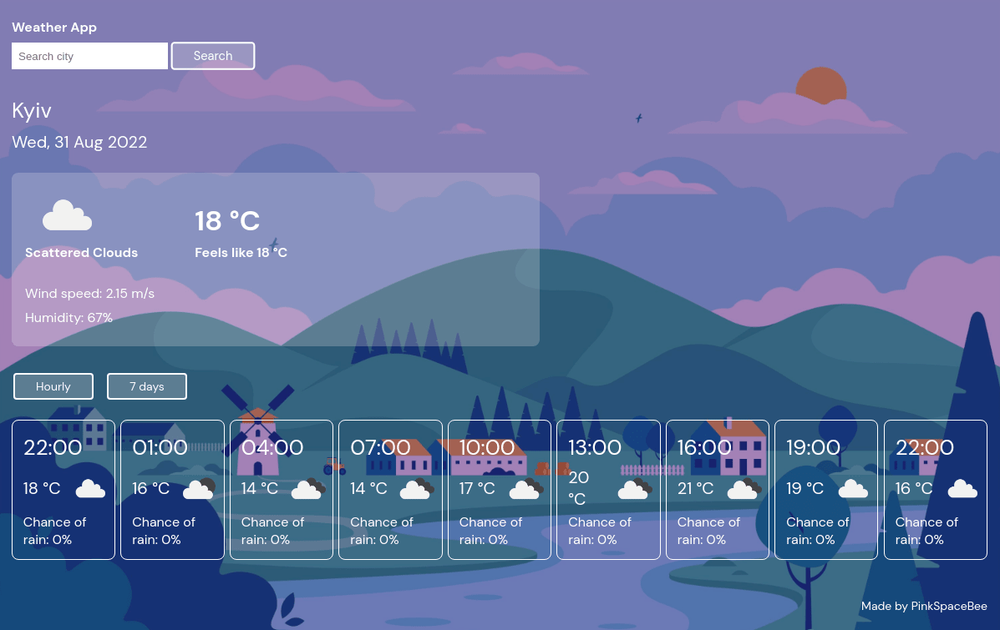

# Weather-App

Uses OpenWeatherMap API to display current, hourly, and daily forecast for the given location. 
I started this project to learn how to work with API and asyncronicity in JavaScript. 

## Built using: 

- JavaScript ES6+
- OpenWeatherMap API
- Sass
- webpack

